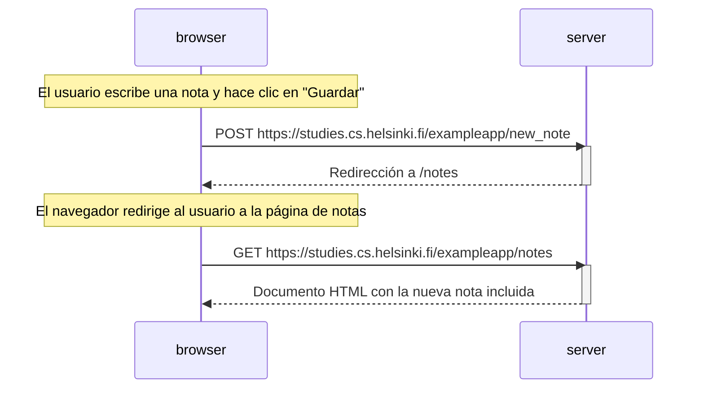

# FullStack-Repository

```mermaid
    sequenceDiagram
    participant Usuario as browser
    participant Servidor as server

    Note over Usuario: El usuario escribe una nota y hace clic en "Guardar"
    Usuario->>Servidor: POST https://studies.cs.helsinki.fi/exampleapp/new_note
    activate Servidor
    Servidor-->>Usuario: Redirección a /notes
    deactivate Servidor

    Note over Usuario: El navegador redirige al usuario a la página de notas
    Usuario->>Servidor: GET https://studies.cs.helsinki.fi/exampleapp/notes
    activate Servidor
    Servidor-->>Usuario: Documento HTML con la nueva nota incluida
    deactivate Servidor

```