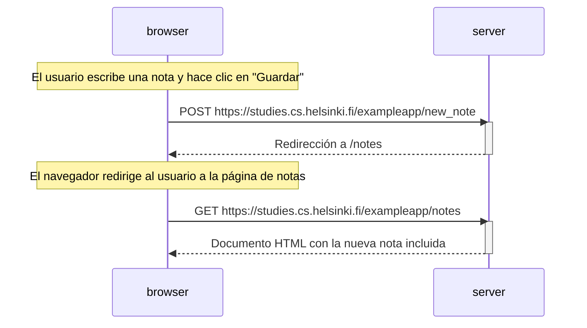
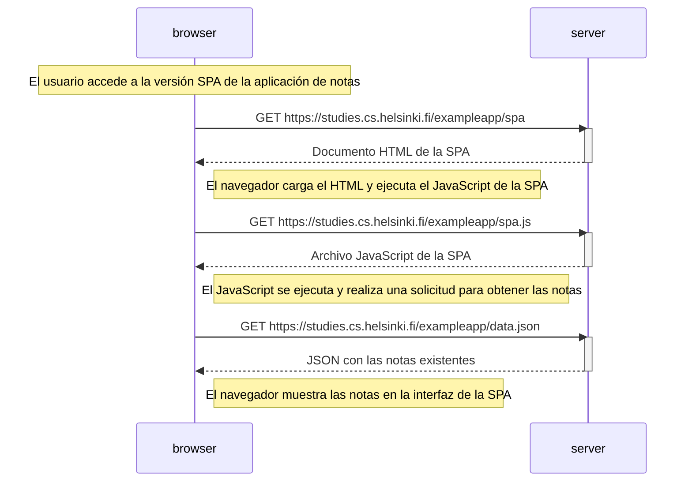
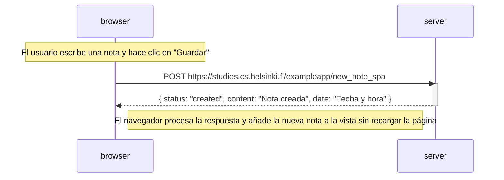

# Diagram 0.4

```mermaid
    sequenceDiagram
    participant Usuario as browser
    participant Servidor as server

    Note over Usuario: El usuario escribe una nota y hace clic en "Guardar"
    Usuario->>Servidor: POST https://studies.cs.helsinki.fi/exampleapp/new_note
    activate Servidor
    Servidor-->>Usuario: Redirección a /notes
    deactivate Servidor

    Note over Usuario: El navegador redirige al usuario a la página de notas
    Usuario->>Servidor: GET https://studies.cs.helsinki.fi/exampleapp/notes
    activate Servidor
    Servidor-->>Usuario: Documento HTML con la nueva nota incluida
    deactivate Servidor
```
# Diagram 0.5

```mermaid
    sequenceDiagram
    participant Usuario as browser
    participant Servidor as server

    Note over Usuario: El usuario accede a la versión SPA de la aplicación de notas
    Usuario->>Servidor: GET https://studies.cs.helsinki.fi/exampleapp/spa
    activate Servidor
    Servidor-->>Usuario: Documento HTML de la SPA
    deactivate Servidor

    Note right of Usuario: El navegador carga el HTML y ejecuta el JavaScript de la SPA
    Usuario->>Servidor: GET https://studies.cs.helsinki.fi/exampleapp/spa.js
    activate Servidor
    Servidor-->>Usuario: Archivo JavaScript de la SPA
    deactivate Servidor

    Note right of Usuario: El JavaScript se ejecuta y realiza una solicitud para obtener las notas
    Usuario->>Servidor: GET https://studies.cs.helsinki.fi/exampleapp/data.json
    activate Servidor
    Servidor-->>Usuario: JSON con las notas existentes
    deactivate Servidor

    Note right of Usuario: El navegador muestra las notas en la interfaz de la SPA
```

# Diagram 0.6

```mermaid
    sequenceDiagram
    participant Usuario as browser
    participant Servidor as server

    Note over Usuario: El usuario escribe una nota y hace clic en "Guardar"
    Usuario->>Servidor: POST https://studies.cs.helsinki.fi/exampleapp/new_note_spa
    activate Servidor
    Servidor-->>Usuario: { status: "created", content: "Nota creada", date: "Fecha y hora" }
    deactivate Servidor

    Note right of Usuario: El navegador procesa la respuesta y añade la nueva nota a la vista sin recargar la página
```